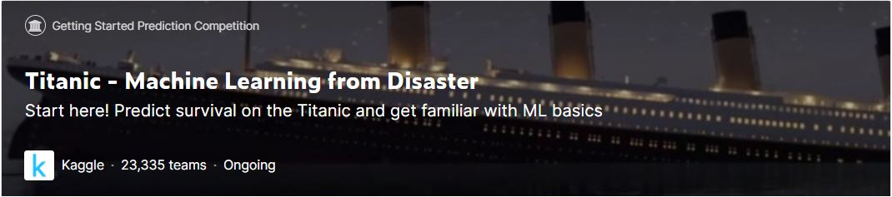

- Link: https://www.kaggle.com/competitions/titanic
# Overview
+ **Objective** : Use machine learning to create a model that predicts which passengers survived the Titanic shipwreck

# Results
  + LB Score for each model

  | Models | Score |
  | ------------- | ------------- |
  | LogisticRegression | 0.77033 |
  | SVM(Support Vector Machine) | 0.78468 |
  | Decision Tree  | 0.75590 |
  | Random Forest  | 0.77511 |
  | AdaBoost  | 0.78947 |
  | Bagging  | 0.77033 |
  | KNN  | 0.77990 |
